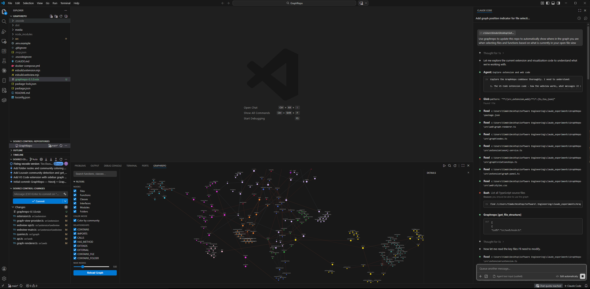

# GraphRepo

A knowledge graph for your codebase. GraphRepo parses your repository into an in-memory graph that captures every file, function, class, import, and call relationship — then exposes it to AI code assistants via MCP so they can traverse the full interconnected structure of your code, not just individual files.


[](https://marketplace.visualstudio.com/items?itemName=the-muses-ltd.graphrepo)



## Why

AI assistants read files one at a time. They can't see how your code connects — which functions call which, how modules depend on each other, or where a change will ripple through. GraphRepo gives them a queryable map of your entire codebase so they can reason about architecture, trace dependencies, and understand context that spans hundreds of files.

## What it does

- **Parses** your repo using Tree-sitter AST analysis (TypeScript, JavaScript, Python, C, C++, C#, Swift) and indexes all file types
- **Builds** an in-memory knowledge graph of files, functions, classes, imports, call chains, and folder structure
- **Detects communities** using Louvain algorithm to identify code modules and clusters
- **Generates embeddings** using Transformers.js for semantic search (local, no API keys)
- **Serves an MCP** with 10 tools that let Claude (or any MCP-compatible assistant) traverse your code graph — search by name, trace call chains, walk dependency trees, and run semantic queries
- **Visualizes** the graph in a VS Code sidebar with an interactive D3-force layout
- **Tracks your editor** — the graph follows your cursor and highlights the node you're working on
- **Shows MCP activity** — watch the graph light up in real time as your AI assistant queries it
- **Supports multiple repos** — parse as many projects as you want, each scoped by name
- **Zero external dependencies** — no Docker, no database servers, everything runs locally

## Getting Started

### 1. Install

**From the VS Code Marketplace (recommended):**

Search for **"GraphRepo"** in the Extensions panel (`Ctrl+Shift+X`), or install from the command line:

```bash
code --install-extension the-muses-ltd.graphrepo
```

**From a VSIX file:**

Download the latest `.vsix` from [GitHub Releases](https://github.com/the-muses-ltd/GraphRepo/releases), then:

```bash
code --install-extension graphrepo-0.7.0.vsix
```

### 2. Parse your repo

Open any project in VS Code, then:

- Press `Ctrl+Shift+P` → **GraphRepo: Parse Workspace**

The graph view in the sidebar will populate automatically. Graph data is stored in `.graphrepo/` inside your workspace.

### 3. Connect your AI assistant

**MCP is auto-configured.** After parsing, GraphRepo creates a `.mcp.json` in your workspace root so Claude Code picks up the MCP tools automatically. Just restart Claude Code after the first parse.

You can also run `Ctrl+Shift+P` → **GraphRepo: Configure MCP for Claude** at any time.

For other MCP clients, add this to your config manually:

```json
{
  "mcpServers": {
    "graphrepo": {
      "command": "node",
      "args": ["<extension-path>/dist/mcp-server.cjs", "serve"],
      "env": {
        "GRAPHREPO_DATA_FILE": "<workspace>/.graphrepo/graph.json",
        "GRAPHREPO_REPO_PATH": "<workspace>"
      }
    }
  }
}
```

Once connected, your AI assistant can traverse your code graph — tracing call chains, walking dependency trees, and understanding relationships that would be invisible from reading files alone.

## MCP Tools

| Tool | Description |
|------|-------------|
| `search_code` | Full-text search for functions, classes, and variables by name |
| `get_file_structure` | List all entities defined in a file |
| `get_dependencies` | What does this file/module import? |
| `get_dependents` | What imports this file/module? |
| `get_call_graph` | Trace function call chains (callers, callees, or both) |
| `find_related` | N-hop graph exploration from any node |
| `run_traversal` | Structured graph traversal with edge type and direction filters |
| `get_summary` | Repo-wide statistics (files, functions, languages, etc.) |
| `get_communities` | Code community detection results at different hierarchy levels |
| `semantic_search` | Find code by meaning using local embeddings |

## Graph Schema

**Nodes:** `File`, `Function`, `Class`, `Interface`, `Variable`, `Module`, `Folder`, `Community`

**Relationships:** `CONTAINS`, `IMPORTS`, `IMPORTS_EXTERNAL`, `CALLS`, `HAS_METHOD`, `EXTENDS`, `CONTAINS_FILE`, `CONTAINS_FOLDER`, `BELONGS_TO_COMMUNITY`, `PARENT_COMMUNITY`

## VS Code Extension

GraphRepo includes a VS Code extension with a sidebar graph view:

- **Follow editor** — graph automatically centers on the file/function you're editing
- **Click to navigate** — click any node to open it in your editor
- **Follow MCP** — watch the graph highlight nodes as your AI assistant queries them
- **Community coloring** — see how your code clusters into modules
- All toggleable from the sidebar controls

## Commands

| Command | Description |
|---------|-------------|
| `npm run parse -- <path>` | Parse a repo into the graph |
| `npm run parse -- <path> --clear` | Clear entire graph, then parse |
| `npm run serve` | Start MCP server (STDIO transport) |
| `npm run viz` | Start visualization server on :3000 |
| `npm run build:ext` | Bundle extension |
| `npm run build:mcp` | Bundle standalone MCP server |
| `npm run build:vscode` | Build extension + webview |
| `npm run typecheck` | Run TypeScript type checking |

## Architecture

```
src/
├── parser/          # Tree-sitter AST parsing (TS, JS, Python, C, C++, C#, Swift)
│   └── languages/   # Per-language extraction logic
├── graph/           # Graphology in-memory graph (store, sync, queries, persistence)
├── graphrag/        # Community detection (Louvain) + Transformers.js embeddings
├── mcp/             # MCP server with 10 tools
├── extension/       # VS Code extension + webview
├── web/             # D3-force visualization (dark theme)
└── cli/             # Commander CLI entry point
```

## Tech Stack

TypeScript, web-tree-sitter, graphology, @huggingface/transformers, @modelcontextprotocol/sdk, d3-force, esbuild, Commander
